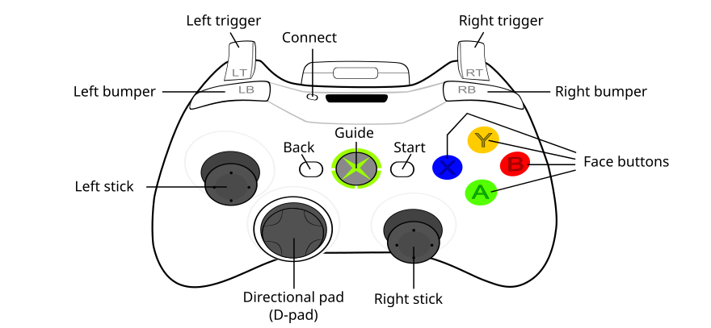

# Robot Operation

## Drive Controller
* Left stick
  * up/down - forward/reverse
  * left/right - strafe
* Right stick
  * left/right - spin
* A-button - robot-relative/half-speed driving with steering correction
* B-button - robot-relative/quarter-speed driving

## Auxilliary Controller
* Left stick + B-button
  * up/down - raise/lower elevator
* A-button - prepare to recieve coral
* D-pad
  * up - select upper reef branch
  * down - select lower reef branch
  * left - shift left
  * right - shift right
* Left bumper - recieve coral
* Right bumper - release coral
* X-button - reverse coral
* Y-button - zero elevator
