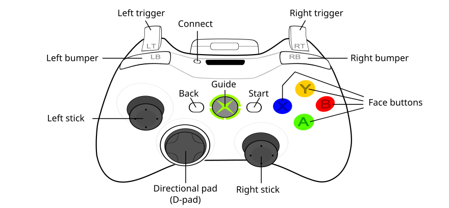

# Robot Operation

## Drive Controller
* Left stick
  * up/down - forward/reverse
  * left/right - strafe
* Right stick
  * left/right - spin
* A-button - align to target (robot-relative)
* Left/right bumper - select slot (reef/coral station)

## Auxilliary Controller
* Left stick
  * up/down - raise/lower elevator
* Right stick
  * up/down - raise/lower end effector
